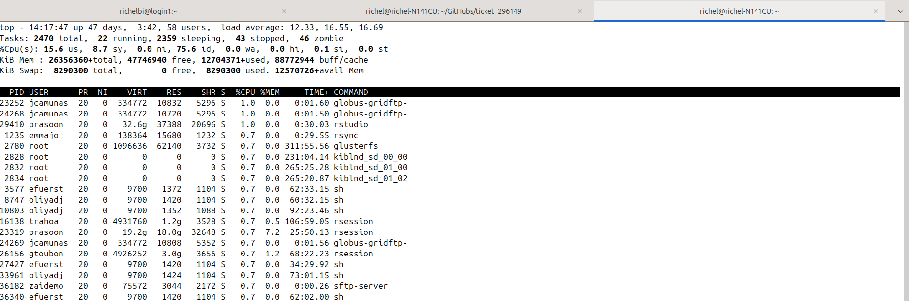
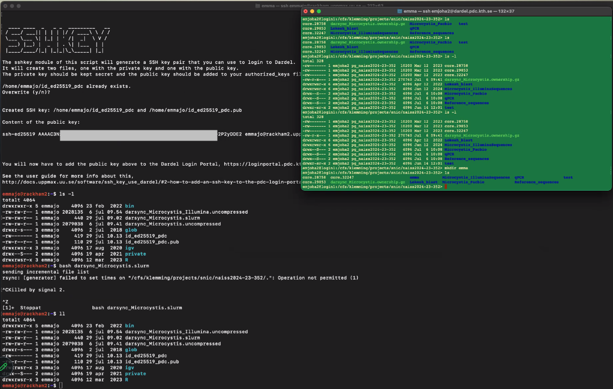

# ticket_296149

## Problem

When running the darsycn script (directly, without sbatch) is
'rsync: [generator] failed to set times on 
"/cfs/klemming/projects/snic/naiss2024-23-352/.": Operation not permitted (1)' 
(see screenshot), after which I asked the user to kill the script 

The folders on Dardel did not show different dates when using `ll`.

## Solution

The error message was only a warning: just run the script again.

The folders do not change dates indeed (as these were created earlier),
but their content is updated as expected.

## Details

The darsync script was run on the login node.
The login node was used, because there was no time to get
a compute allocation via official procedures, 
as it is holidays for most colleague.

It was checked if the login node was overburdened,
it was seen that the user `emmajo` (at the fourth
process) only used 0.7% of CPU capacity of the login node,
hence it would not disturb other users too much



## Iteration 2

### Approach 1: cautious

Run the darsync script on the login node, 
see if the contents in the folders is changed

### Approach 2: ruthless

Delete the backup folders on Dardel, then sync again

On Dardel, do:

```bash
rm -rf Microcystis_Pacbio
rm -rf qPCR
rm -rf Reference_sequences
```

Then run the darsync script on the login node to see if the folders
are created again.

## Problem

After meeting with the user, the following was discoved/confirmed:

- SSH keys are created correctly using `darsync sshkey` and then uploadad 
  correctly to the PDC portal with the added `*.uppmax.uu.se`
- User can create a folder on the Dardel project `naiss2024-23-352`
  (see screenshot)
- Error when running the darsycn script (directly, without sbatch) is
  'rsync: [generator] failed to set times on 
  "/cfs/klemming/projects/snic/naiss2024-23-352/.": Operation not permitted (1)' 
  (see screenshot), after which I asked the user to kill the script 



Hypothesis, as shared in email to user:

```bash
[...]

I think now:

It was working perfectly fine!

The error given was caused by the folders on Dardel *already being present*, which is correct, as you've run (and stopped) the script before!

To solve your problem, I suggest to:

Run that script again and wait. If you want to check if something happens on Dardel, *go into the folders* and see if anything changes there.

Let me know if you can try it and its results: maybe we don't need a meeting at 14:00 :-) . If you did not have time, sure, see you at 14:00 at https://uu-se.zoom.us/s/7093465705 with passcode 42 (I will do a bit more research to see if my theory holds up) :-)

[...]
```

My hypothesis is backed up by [this Stack Overflow](https://stackoverflow.com/a/54861420)
post, where the solution was suggested to delete the folders to `rsync` to.
I will add this option to the list of possible solutions.


- [IRRELEVANT] [Stack Overflow](https://stackoverflow.com/questions/65843766/what-does-rsync-failed-to-set-times-on-really-means) 
  seems irrelevant, as it describes the error and then crashes
- [Stack Overflow](https://stackoverflow.com/questions/667992/rsync-error-failed-to-set-times-on-foo-bar-operation-not-permitted)
  - [This answer](https://stackoverflow.com/a/8757684) seems relevant: maybe the user does not own the folder to send the data
    too. Judging from the screenshot, I see some folders:

```text
-rw-r-x--- 1 enjoha2 pg_naiss2024-23-352 270760 Jul  6 darsync_Microcystis.ownership.gz
drwxrwsr-x 6 enjoha2 pg_naiss2024-23-352   4096 Apr 12 Lokesh_blast <-- IRRELEVANT FOLDER
drwxrwsr-x 6 enjoha2 pg_naiss2024-23-352   4096 Apr 12 Microcystis_IlluminaSequences <-- IRRELEVANT FOLDER
drwxrwS--- 2 enjoha2 pg_naiss2024-23-352   4096 Jul  6 Microcystis_Pacbio
drwxrwS--- 2 enjoha2 pg_naiss2024-23-352   4096 Jul  6 qPCR
drwxrwS--- 2 enjoha2 pg_naiss2024-23-352   4096 Jul  6 Reference_sequences
drwxr-sr-x 6 enjoha2 pg_naiss2024-23-352   4096 Jun 14 test [1]
^^^^^^^^^^
||||||||||
|||||||+++--- Public
|||||||
||||+++------ Group
||||
|+++--------- Owner
|
+------------ This is a directory

- `s`: `setuid` bit, [source](https://unix.stackexchange.com/a/118855)
- `S`: [source](https://unix.stackexchange.com/a/27254)
- [1] User can create folder


```

It may indeed be a folder owner issue. Let's check my own Dardel folders.
 * [ ] Check my Dardel file permissions


```bash
[richel@rackham2 richel]$ git clone https://github.com/UPPMAX/ticket_296149.git
[...]
[richel@rackham2 richel]$ ll
[...]
drwxrwxr-x 3 richel richel   4096 Jul 29 13:53 ticket_296149
```


```
[richel@rackham2 richel]$ module load darsync
[richel@rackham2 richel]$ darsync


  ____    _    ____  ______   ___   _  ____ 
 |  _ \  / \  |  _ \/ ___\ \ / / \ | |/ ___|
 | | | |/ _ \ | |_) \___ \\ V /|  \| | |    
 | |_| / ___ \|  _ < ___) || | | |\  | |___ 
 |____/_/   \_\_| \_\____/ |_| |_| \_|\____|

Welcome to the Dardel data transfer tool.

Please run `darsync -h` to see details on how to run the script 
using command line options instead of interactive questions.

    
This tool can do two things;
    1) analyze a folder and make suggestions what could be 
       done before transferring the data.
    2) generate a SLURM script that you can submit to the 
       queue that will run the data transfer.

We recommend that you run the `check` part first and fix any problems it finds, 
e.g. compressing files and/or removing files. Once that is done you can run 
this script again and choose `gen` to create a SLURM script that you submit 
to the queue system to do the actual data transfer.
    
You now have to choose which of these two things you want to do. 
Type `check` (without the quotes) to start the analysis mode, 
or type `gen` (without the quotes) to generate the SLURM script.
    
check/gen? : gen


   ____ _____ _   _
  / ___| ____| \ | |
 | |  _|  _| |  \| |
 | |_| | |___| |\  |
  \____|_____|_| \_|

The gen module of this script will collect the information needed
and generate a script that can be submitted to SLURM to preform the
data transfer.

It will require you to know 

    1) Which directory on UPPMAX you want to transfer (local directory).
    2) Which UPPMAX project id the SLURM job should be run under. 
        ex. naiss2099-23-999
    3) Which cluster the SLURM job should be run on.
        ex. rackham, snowy
    4) Which username you have at Dardel.
    5) Where on Dardel it should transfer your data to. 
        ex. /cfs/klemming/projects/snic/naiss2099-23-999/from_uppmax
    6) Which SSH key should be used when connecting to Dardel.
        ex. /home/user/id_ed25519_pdc
    7) Where you want to save the generated SLURM script. 


Specify which directory you want to copy. 
Make sure to use tab completion (press the tab key to complete directory names) 
to avoid spelling errors.
Ex.
/proj/naiss2099-22-999/
or
/proj/naiss2099-22-999/raw_data_only

Specify local directory: /home/richel/ticket_296149/


Specify which project id should be used to run the data transfer job in SLURM.
Ex.
naiss2099-23-999

Specify project id: staff


Specify which cluster the SLURM job should be run on.
Choose between rackham and snowy.
Default is rackham

Specify cluster: 


Specify the username that should be used to login at Dardel. 
It is the username you have created at PDC and it is 
probably not the same as your UPPMAX username.

Specify Dardel username: richelbi


Specify the directory on Dardel you want to transfer your data to.
Ex.
/cfs/klemming/projects/snic/naiss2099-23-999

Specify Dardel path: /cfs/klemming/home/r/richelbi


Specify which SSH key should be used to login to Dardel. 
Create one by running `dardel_ssh-keygen` if you have not done so yet. 
If no path is given it will use the default key created by `dardel_ssh-keygen`, 
~/id_ed25519_pdc
                    
Specify SSH key: 


Specify where the SLURM script file should be saved. 
If not given it will save it here: ~/darsync_ticket_296149.slurm
                    
Specify SLURM script path: 


  ____   ___  _   _ _____ 
 |  _ \ / _ \| \ | | ____|
 | | | | | | |  \| |  _|  
 | |_| | |_| | |\  | |___ 
 |____/ \___/|_| \_|_____|


Created SLURM script: /home/richel/darsync_ticket_296149.slurm

containing the following command:

rsync -e "ssh -i /home/richel/id_ed25519_pdc -o StrictHostKeyChecking=no" -acPuv /home/richel/ticket_296149/ richelbi@dardel.pdc.kth.se:/cfs/klemming/home/r/richelbi


To test if the generated file works, run

bash /home/richel/darsync_ticket_296149.slurm

If the transfer starts you know the script is working, and you can terminate 
it by pressing ctrl+c and submit the script as a SLURM job.

Run this command to submit it as a job:

sbatch /home/richel/darsync_ticket_296149.slurm


[richel@rackham2 richel]$ sbatch /home/richel/darsync_ticket_296149.slurm
Submitted batch job 48991988 on cluster rackham
[richel@rackham2 richel]$ 
[richel@rackham2 richel]$ squeue -u $USER
             JOBID PARTITION     NAME     USER ST       TIME  NODES NODELIST(REASON)
          48991988      core darsync_   richel PD       0:00      1 (None)
[richel@rackham2 richel]$ squeue -u $USER
             JOBID PARTITION     NAME     USER ST       TIME  NODES NODELIST(REASON)
          48991988      core darsync_   richel PD       0:00      1 (None)
[richel@rackham2 richel]$ squeue -u $USER
             JOBID PARTITION     NAME     USER ST       TIME  NODES NODELIST(REASON)
          48991988      core darsync_   richel PD       0:00      1 (None)
[richel@rackham2 richel]$ squeue -u $USER
             JOBID PARTITION     NAME     USER ST       TIME  NODES NODELIST(REASON)
          48991988      core darsync_   richel PD       0:00      1 (None)
[richel@rackham2 richel]$ scancel 48991988
[richel@rackham2 richel]$ bash /home/richel/darsync_ticket_296149.slurm
sending incremental file list
./
.gitignore
            671 100%    0.00kB/s    0:00:00 (xfr#1, to-chk=70/72)
LICENSE
         35,149 100%   33.52MB/s    0:00:00 (xfr#2, to-chk=69/72)
README.md
          6,719 100%    6.41MB/s    0:00:00 (xfr#3, to-chk=68/72)
screenshot.png
        598,146 100%  190.15MB/s    0:00:00 (xfr#4, to-chk=67/72)
.git/
.git/HEAD
             21 100%    0.41kB/s    0:00:00 (xfr#5, to-chk=65/72)
.git/config
            264 100%    5.16kB/s    0:00:00 (xfr#6, to-chk=64/72)
.git/description
             73 100%    1.43kB/s    0:00:00 (xfr#7, to-chk=63/72)
.git/index
            336 100%    6.43kB/s    0:00:00 (xfr#8, to-chk=62/72)
.git/packed-refs
            105 100%    2.01kB/s    0:00:00 (xfr#9, to-chk=61/72)
.git/branches/
.git/hooks/
.git/hooks/applypatch-msg.sample
            452 100%    8.66kB/s    0:00:00 (xfr#10, to-chk=54/72)
.git/hooks/commit-msg.sample
            896 100%   16.83kB/s    0:00:00 (xfr#11, to-chk=53/72)
.git/hooks/post-update.sample
            189 100%    3.55kB/s    0:00:00 (xfr#12, to-chk=52/72)
.git/hooks/pre-applypatch.sample
            398 100%    7.47kB/s    0:00:00 (xfr#13, to-chk=51/72)
.git/hooks/pre-commit.sample
          1,704 100%   31.40kB/s    0:00:00 (xfr#14, to-chk=50/72)
.git/hooks/pre-push.sample
          1,348 100%   24.84kB/s    0:00:00 (xfr#15, to-chk=49/72)
.git/hooks/pre-rebase.sample
          4,951 100%   91.23kB/s    0:00:00 (xfr#16, to-chk=48/72)
.git/hooks/prepare-commit-msg.sample
          1,239 100%   22.41kB/s    0:00:00 (xfr#17, to-chk=47/72)
.git/hooks/update.sample
          3,611 100%   65.30kB/s    0:00:00 (xfr#18, to-chk=46/72)
.git/info/
.git/info/exclude
            240 100%    4.34kB/s    0:00:00 (xfr#19, to-chk=45/72)
.git/logs/
.git/logs/HEAD
            201 100%    3.63kB/s    0:00:00 (xfr#20, to-chk=44/72)
.git/logs/refs/
.git/logs/refs/heads/
.git/logs/refs/heads/main
            201 100%    3.57kB/s    0:00:00 (xfr#21, to-chk=40/72)
.git/logs/refs/remotes/
.git/logs/refs/remotes/origin/
.git/logs/refs/remotes/origin/HEAD
            201 100%    3.57kB/s    0:00:00 (xfr#22, to-chk=38/72)
.git/objects/
.git/objects/01/
.git/objects/01/da96bf5c66a022c7faadea66eb2ba42ccaba85
            163 100%    2.89kB/s    0:00:00 (xfr#23, to-chk=20/72)
.git/objects/24/
.git/objects/24/fce1d1fe631e2e29cdb95f9fb07454a5e2f238
             37 100%    0.66kB/s    0:00:00 (xfr#24, to-chk=19/72)
.git/objects/26/
.git/objects/26/730f93ebdeb3c926b02416d6a1e5b846a8be49
          3,118 100%   54.37kB/s    0:00:00 (xfr#25, to-chk=18/72)
.git/objects/28/
.git/objects/28/b88c99dbf837580dc6143b3a3bbbc78d149d14
          2,964 100%   51.69kB/s    0:00:00 (xfr#26, to-chk=17/72)
.git/objects/2c/
.git/objects/2c/3e92019f55994ab0f2f16e9ad1119b4d77b477
            171 100%    2.98kB/s    0:00:00 (xfr#27, to-chk=16/72)
.git/objects/34/
.git/objects/34/6b431202d8a4a7d6a7e99a29727ba08db88327
            120 100%    2.09kB/s    0:00:00 (xfr#28, to-chk=15/72)
.git/objects/77/
.git/objects/77/3e7eb6090a6b2b06541d0cfae1322b01adcc08
            160 100%    2.79kB/s    0:00:00 (xfr#29, to-chk=14/72)
.git/objects/8c/
.git/objects/8c/8d9a7901025005767431876a9a14cffebe8e13
            158 100%    2.76kB/s    0:00:00 (xfr#30, to-chk=13/72)
.git/objects/a7/
.git/objects/a7/eebba8f287a4fd4c1ae75a1857fc93ebd040d1
        587,577 100%    9.50MB/s    0:00:00 (xfr#31, to-chk=12/72)
.git/objects/bb/
.git/objects/bb/284ab08beeb89e1214fd9794781d3b1929adb5
            120 100%    1.99kB/s    0:00:00 (xfr#32, to-chk=11/72)
.git/objects/c1/
.git/objects/c1/215bd77c85b6298e552dcb1c0f7f2c396bad88
            793 100%   13.13kB/s    0:00:00 (xfr#33, to-chk=10/72)
.git/objects/e4/
.git/objects/e4/01865facc4ae7de444b57e2679ab7f705180f2
          1,628 100%   26.95kB/s    0:00:00 (xfr#34, to-chk=9/72)
.git/objects/e7/
.git/objects/e7/5435c1b1aa229e6b2e849b5da20696779bf734
            406 100%    6.61kB/s    0:00:00 (xfr#35, to-chk=8/72)
.git/objects/f0/
.git/objects/f0/a3899b5467f567817e054cc5de858f5301151e
            158 100%    2.57kB/s    0:00:00 (xfr#36, to-chk=7/72)
.git/objects/f2/
.git/objects/f2/88702d2fa16d3cdf0035b15a9fcbc552cd88e7
         14,219 100%  231.43kB/s    0:00:00 (xfr#37, to-chk=6/72)
.git/objects/info/
.git/objects/pack/
.git/refs/
.git/refs/heads/
.git/refs/heads/main
             41 100%    0.67kB/s    0:00:00 (xfr#38, to-chk=2/72)
.git/refs/remotes/
.git/refs/remotes/origin/
.git/refs/remotes/origin/HEAD
             30 100%    0.48kB/s    0:00:00 (xfr#39, to-chk=0/72)
.git/refs/tags/

sent 1,273,886 bytes  received 908 bytes  283,287.56 bytes/sec
total size is 1,268,978  speedup is 1.00
[richel@rackham2 richel]$ bash /home/richel/darsync_ticket_296149.slurm
sending incremental file list

sent 2,828 bytes  received 44 bytes  638.22 bytes/sec
total size is 1,268,978  speedup is 441.84
```

Results in:

```
richelbi@login1:~> ll
total 640
-rw-rw-r--  1 richelbi richelbi  35149 Jul 29 13:53 LICENSE
drwx------+ 2 richelbi richelbi   4096 Feb  6 09:30 Private
drwxr-xr-x+ 2 richelbi richelbi   4096 Feb  6 09:30 Public
-rw-rw-r--  1 richelbi richelbi   6719 Jul 29 13:53 README.md
-rw-rw-r--  1 richelbi richelbi 598146 Jul 29 13:53 screenshot.png
```


## Iteration 1

### Solution 1

Suggest to create a Rackham Small project and do the transfer with its computational resources

### Problem 1

> I did write previously about problems when trying to transfer files from rackham to dardel (NAISS support #294917). 
> I got a link (https://docs.uppmax.uu.se/cluster_guides/dardel_migration/) and have followed the info there. 
> I have managed to create the slurm script for transferring my data from rackham to dardel, but when running the script, I get an error message:
> sbatch: error: Batch job submission failed: Invalid account or account/partition combination specified
>
> Why is that? I suppose that my new compute project (naiss2024-22-760) should work also on rackham?

I am unsure why it does not work on Rackham. I am sure there is no `naiss2024-22-760`, 
as when I search the `proj` folder for any project starting with `naiss2024-22-76`,
I do not see yours:

```bash
[richel@rackham3 proj]$ find . | grep naiss2024-22-76
./naiss2024-22-769
```

I assume you see the same, when (following the documentation at https://docs.uppmax.uu.se/getting_started/project/#view-your-uppmax-projects )
you visit https://supr.naiss.se .


> Also, when I do a check on wether the generated script works (as instructed when the darsync gen script is 
> finished: bash /home/emmajo/darsync_Microcystis.slurm) the file transfer actually starts! 
> And I find it a bit odd that running the script with bash works but not when submitting it with 
> sbatch. (I did terminate the transfer though, since there are quite many files, and since I 
> also need to transfer other folders from rackham to dardel I would want a script that actually works!)

It is expected that one can run scripts directly, without using `sbatch`:
it means the script is run on the shared login node. Maybe the node has been
empty enough, maybe the job is light enough, maybe you've gotten an email
from my colleagues that you're overusing the login node :-) . 


> This is how my generated script looks like:

```
#!/bin/bash -l
#SBATCH -A naiss2024-22-760
#SBATCH -M rackham
#SBATCH -t 10-00:00:00
#SBATCH -p core
#SBATCH -n 1
#SBATCH -J darsync_Microcystis
#SBATCH --output=/home/emmajo/darsync_Microcystis.out
#SBATCH --error=/home/emmajo/darsync_Microcystis.err

rsync -e "ssh -i /home/emmajo/id_ed25519 -o StrictHostKeyChecking=no" -acPuv /proj/uppstore2017173/Microcystis/ emjoha2@dardel.pdc.kth.se:/cfs/klemming/projects/snic/naiss2024-23-352
```

Looks great! And, as stated before, it will not work, because `naiss2024-22-760` is not a Rackham project.


> Should also say that both the storage (uppstore2017173) on rackham, and the compute (naiss2023-22-475) projects has expired, 
> which might also cause some problems? 
> These projects belong to my former PhD supervisor (Karin Rengefors), 
> and since I haven't finished all bioinformatics after my defense, 
> she and I decided that I would work with the data on my own 
> storage/compute projects (naiss2024-22-760 and naiss2024-23-352, respectively).

Sure, that can work perfectly fine :-)

I did check if the other project is a Rackham project, but also here, I found nothing on Rackham:


```bash
[richel@rackham3 proj]$ find . | grep naiss2024-23-35.
./naiss2024-23-354
./naiss2024-23-359
./naiss2024-23-358
```

