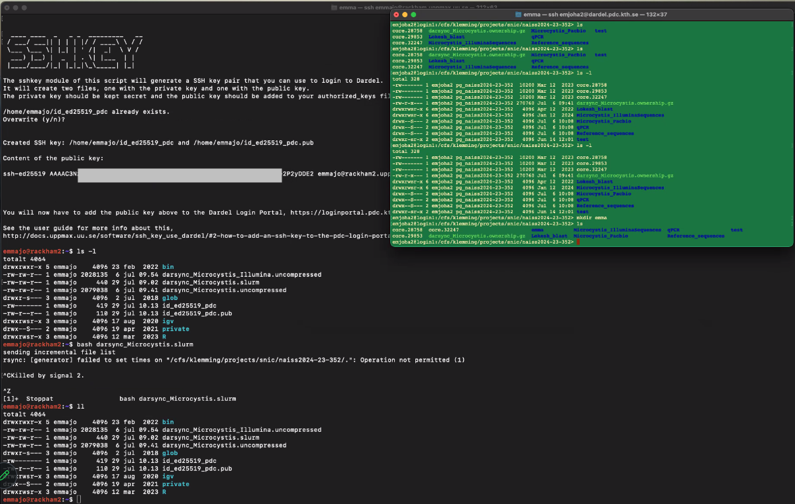

# ticket_296149

## Solution

### Approach 1: cautious

Run the darsync script on the login node, 
see if the contents in the folders is changed

### Approach 2: ruthless

Delete the backup folders on Dardel, then sync again

On Dardel, do:

```bash
rm -rf Microcystis_Pacbio
rm -rf qPCR
rm -rf Reference_sequences
```

Then run the darsync script on the login node to see if the folders
are created again.

## Problem

After meeting with the user, the following was discoved/confirmed:

- SSH keys are created correctly using `darsync sshkey` and then uploadad 
  correctly to the PDC portal with the added `*.uppmax.uu.se`
- User can create a folder on the Dardel project `naiss2024-23-352`
  (see screenshot)
- Error when running the darsycn script (directly, without sbatch) is
  'rsync: [generator] failed to set times on 
  "/cfs/klemming/projects/snic/naiss2024-23-352/.": Operation not permitted (1)' 
  (see screenshot), after which I asked the user to kill the script 



Hypothesis, as shared in email to user:

```bash
[...]

I think now:

It was working perfectly fine!

The error given was caused by the folders on Dardel *already being present*, which is correct, as you've run (and stopped) the script before!

To solve your problem, I suggest to:

Run that script again and wait. If you want to check if something happens on Dardel, *go into the folders* and see if anything changes there.

Let me know if you can try it and its results: maybe we don't need a meeting at 14:00 :-) . If you did not have time, sure, see you at 14:00 at https://uu-se.zoom.us/s/7093465705 with passcode 42 (I will do a bit more research to see if my theory holds up) :-)

[...]
```

My hypothesis is backed up by [this Stack Overflow](https://stackoverflow.com/a/54861420)
post, where the solution was suggested to delete the folders to `rsync` to.
I will add this option to the list of possible solutions.


- [IRRELEVANT] [Stack Overflow](https://stackoverflow.com/questions/65843766/what-does-rsync-failed-to-set-times-on-really-means) 
  seems irrelevant, as it describes the error and then crashes
- [Stack Overflow](https://stackoverflow.com/questions/667992/rsync-error-failed-to-set-times-on-foo-bar-operation-not-permitted)
  - [This answer](https://stackoverflow.com/a/8757684) seems relevant: maybe the user does not own the folder to send the data
    too. Judging from the screenshot, I see some folders:

```text
-rw-r-x--- 1 enjoha2 pg_naiss2024-23-352 270760 Jul  6 darsync_Microcystis.ownership.gz
drwxrwsr-x 6 enjoha2 pg_naiss2024-23-352   4096 Apr 12 Lokesh_blast <-- IRRELEVANT FOLDER
drwxrwsr-x 6 enjoha2 pg_naiss2024-23-352   4096 Apr 12 Microcystis_IlluminaSequences <-- IRRELEVANT FOLDER
drwxrwS--- 2 enjoha2 pg_naiss2024-23-352   4096 Jul  6 Microcystis_Pacbio
drwxrwS--- 2 enjoha2 pg_naiss2024-23-352   4096 Jul  6 qPCR
drwxrwS--- 2 enjoha2 pg_naiss2024-23-352   4096 Jul  6 Reference_sequences
drwxr-sr-x 6 enjoha2 pg_naiss2024-23-352   4096 Jun 14 test [1]
^^^^^^^^^^
||||||||||
|||||||+++--- Public
|||||||
||||+++------ Group
||||
|+++--------- Owner
|
+------------ This is a directory

- `s`: `setuid` bit, [source](https://unix.stackexchange.com/a/118855)
- `S`: [source](https://unix.stackexchange.com/a/27254)
- [1] User can create folder


```

It may indeed be a folder owner issue. Let's check my own Dardel folders.
 * [ ] Check my Dardel file permissions


## Iteration 1

### Solution 1

Suggest to create a Rackham Small project and do the transfer with its computational resources

### Problem 1

> I did write previously about problems when trying to transfer files from rackham to dardel (NAISS support #294917). 
> I got a link (https://docs.uppmax.uu.se/cluster_guides/dardel_migration/) and have followed the info there. 
> I have managed to create the slurm script for transferring my data from rackham to dardel, but when running the script, I get an error message:
> sbatch: error: Batch job submission failed: Invalid account or account/partition combination specified
>
> Why is that? I suppose that my new compute project (naiss2024-22-760) should work also on rackham?

I am unsure why it does not work on Rackham. I am sure there is no `naiss2024-22-760`, 
as when I search the `proj` folder for any project starting with `naiss2024-22-76`,
I do not see yours:

```bash
[richel@rackham3 proj]$ find . | grep naiss2024-22-76
./naiss2024-22-769
```

I assume you see the same, when (following the documentation at https://docs.uppmax.uu.se/getting_started/project/#view-your-uppmax-projects )
you visit https://supr.naiss.se .


> Also, when I do a check on wether the generated script works (as instructed when the darsync gen script is 
> finished: bash /home/emmajo/darsync_Microcystis.slurm) the file transfer actually starts! 
> And I find it a bit odd that running the script with bash works but not when submitting it with 
> sbatch. (I did terminate the transfer though, since there are quite many files, and since I 
> also need to transfer other folders from rackham to dardel I would want a script that actually works!)

It is expected that one can run scripts directly, without using `sbatch`:
it means the script is run on the shared login node. Maybe the node has been
empty enough, maybe the job is light enough, maybe you've gotten an email
from my colleagues that you're overusing the login node :-) . 


> This is how my generated script looks like:

```
#!/bin/bash -l
#SBATCH -A naiss2024-22-760
#SBATCH -M rackham
#SBATCH -t 10-00:00:00
#SBATCH -p core
#SBATCH -n 1
#SBATCH -J darsync_Microcystis
#SBATCH --output=/home/emmajo/darsync_Microcystis.out
#SBATCH --error=/home/emmajo/darsync_Microcystis.err

rsync -e "ssh -i /home/emmajo/id_ed25519 -o StrictHostKeyChecking=no" -acPuv /proj/uppstore2017173/Microcystis/ emjoha2@dardel.pdc.kth.se:/cfs/klemming/projects/snic/naiss2024-23-352
```

Looks great! And, as stated before, it will not work, because `naiss2024-22-760` is not a Rackham project.


> Should also say that both the storage (uppstore2017173) on rackham, and the compute (naiss2023-22-475) projects has expired, 
> which might also cause some problems? 
> These projects belong to my former PhD supervisor (Karin Rengefors), 
> and since I haven't finished all bioinformatics after my defense, 
> she and I decided that I would work with the data on my own 
> storage/compute projects (naiss2024-22-760 and naiss2024-23-352, respectively).

Sure, that can work perfectly fine :-)

I did check if the other project is a Rackham project, but also here, I found nothing on Rackham:


```bash
[richel@rackham3 proj]$ find . | grep naiss2024-23-35.
./naiss2024-23-354
./naiss2024-23-359
./naiss2024-23-358
```

